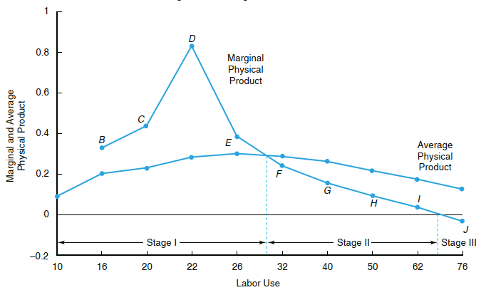

```{r setup, include=FALSE}
knitr::opts_chunk$set(echo = FALSE)
```

## PENDAHULUAN

Modul 4 ini membahas tingkah laku produsen pertanian, khususnya petani dan pelaku pertanian skala perusahaan dalam penggunaan sumber daya yang terbatas pada proses produksi. Setelah mempelajari Modul 4 ini Anda diharapkan mampu menjelaskan esensi utama dari tingkah laku produsen dan penggunaan sumber daya dalam aktivitas produksi pertanian. Secara khusus, setelah mempelajari Modul 4 ini dengan baik, Anda diharapkan mampu:

- [x] menjelaskan kualitas sumber daya pertanian
- [x] menjelaskan hubungan proses produksi dan sumber daya tersebut
- [x] menjelaskan konsep dan interpretasi elastisitas produksi
- [x] menjelaskan keputusan ekonomi dengan maksimisasi keuntungan

<br />


##  KEGIATAN BELAJAR 1: Produksi dan Penggunaan Sumber Daya

### A. KONDISI PERSAINGAN DAN KLASIFIKASI SUMBER DAYA

Kondisi Persaingan Sempurna:

1. Produk yang dijual homogen
2. Free entry and exit
3. Jumlah penjual cukup banyak
4. Perfect information: harga, jumlah, sumber bahan baku dsb

Empat Golongan Sumber Daya:

1. Lahan
2. Tenaga Kerja
3. Modal
4. Manajemen/Kewirausahaan


### B. HUBUNGAN FUNGSIONAL PRODUKSI

\begin{align*}
Output = f(jumlah\,input_1,\, jumlah\,input_2,\, jumlah\,input_3,\,dst)\\
Output = f(tenaga\,kerja|modal, lahan, manajemen)
\end{align*}

### C. FUNGSI PRODUKSI NEOKLASIK



`Sumber: Penson (2018)`

- The law of deminishing marginal return
- Marginal product dan average product

### D. ELASTISITAS PRODUKSI (Ep)

\begin{align*}
Ep = \frac {\Delta y/y}{\Delta x/x}\\
Ep = (dy/dx).(x/y)\\
Ep=MPP/APP
\end{align*}

### E. MAKSIMISASI KEUNTUNGAN DARI PERSPEKTIF PRODUKSI

$$Laba\,Max.\,->\,VMP=r,\,dimana\,VMP=p.MPP$$
r= rent (sewa modal)

p= harga output

### F. DAERAH EKONOMIS FUNGSI PRODUKSI

--> Perhatikan Gambar 4.1.

- Daerah 1: Ep>1 (daerah tidak ekonomis, output masih bisa ditingkatkan dengan +input)
- Daerah 2: 0<Ep<1 (daerah ekonomis)
- Daerah 3: Ep<0 (daerah tidak ekonomis, output turun dengan +input, buang-buang duit)

### G. FAKTOR PRODUKSI LAHAN: REFORMA AGRARIA

- Faktor produksi paling sensitif di Indonesia
