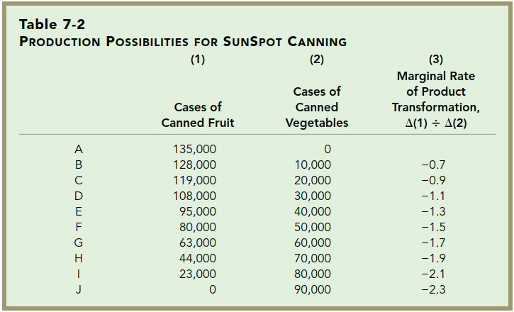
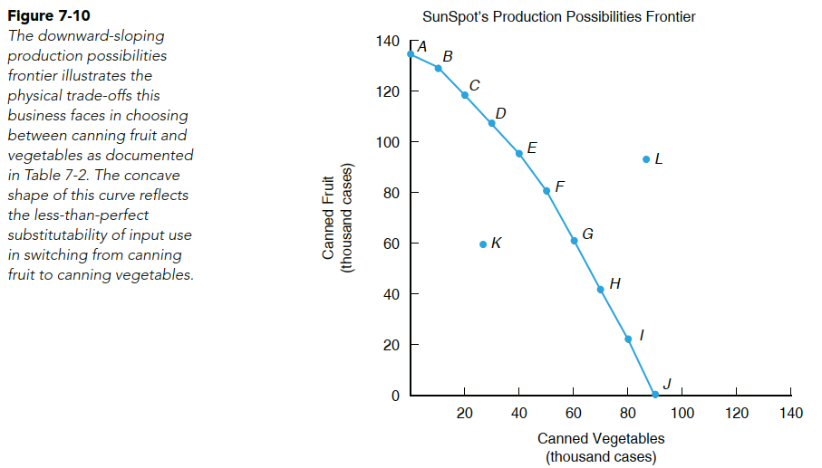
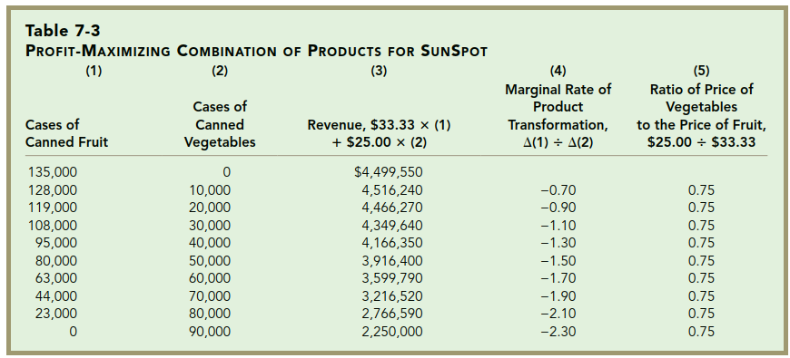
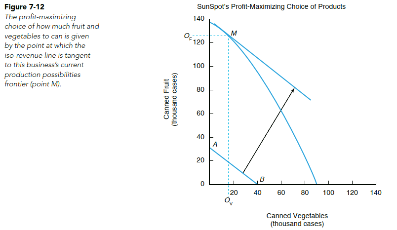
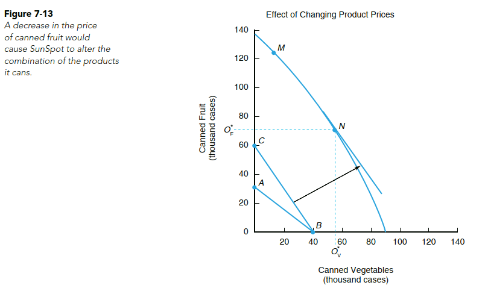

```{r setup, include=FALSE}
knitr::opts_chunk$set(echo = FALSE)
```


## PENDAHULUAN

Pada modul ini kita akan membahas beberapa prinsip yang harus diambil oleh petani dan pelaku usaha pertanian untuk perencanaan produksi yang menghasilkan output lebih dari satu dan kombinasi input lebih dari satu juga tentunya.

Secara khusus, mahasiswa diharapkan mampu menjelaskan:

- [x] konsep kurva kemungkinan produksi
- [x] konsep laju pertukaran produksi
- [x] hubungan output pada proses maksimisasi keuntungan


<br />

## KEGIATAN BELAJAR: PERENCANAAN PRODUKSI DAN KOMBINASI OUTPUT

### A. PRODUKSI DENGAN DUA OUTPUT

- Kurva Kemungkinan Produksi (*Production Possibilities Frontier*): illustrates the 
maximum output for different combinations of two products a firm can produce, given its existing resources.
- Perhatikan Tabel berikut:



`Sumber: Penson, et.al (2018)`

### B. LAJU PERTUKARAN PRODUKSI (*marginal rate of product transformation*)

- Represents the rate at which the canning of fruit must contract (expand) for a one-case increase (decrease) in vegetable canning. 
- The marginal product rate of transformation in absolute terms is given by

$$marginal\ rate\ of\ product\ transformation = \frac {\Delta canned\ fruit}{\Delta canned\ vegetables}$$
<br />



`Sumber: Penson, et.al (2018)`

<br />

### Konsep Iso-Revenue

total revenue = (price of canned fruit * cases of canned fruit) 
 + (price of canned vegetables * cases of canned vegetables) 
 
slope of iso-revenue line = - price of vegetables/price of fruit 


### D. MAKSIMISASI KEUNTUNGAN PADA KASUS DUA OUTPUT



`Sumber: Penson, et.al (2018)`

<br />

$$\frac {\Delta canned\ fruit}{\Delta canned\ vegetables}= - \frac {price\ of\ vegetables}{price\ of\ fruit}$$
<br />



`Sumber: Penson, et.al (2018)`

<br />

### Dampak Perubahan Harga terhadap Kombinasi Produk



`Sumber: Penson, et.al (2018)`