```{r setup, include=FALSE}
knitr::opts_chunk$set(echo = FALSE)
```

## Pendahuluan

Pada sesi ini, kita akan membahas Modul 8: Keseimbangan Pasar pada Persaingan Sempurna dan Modul 9: Keseimbangan Pasar pada Persaingan Tidak Sempurna. 

Setelah mempelajari Modul 8, Anda diharapkan mampu menjelaskan konsep keseimbangan pasar pada persaingan sempurna. Secara khusus, setelah mempelajari Modul 8, Anda diharapkan mampu:

1. menjelaskan konsep surplus konsumen dan surplus produsen
2. menjelaskan pembentukan keseimbangan pasar dan variasinya
3. menjelaskan surplus ekonomi total dan aplikasi analisis kebijakan
4. menjelaskan proses penyesuaian pada keseimbangan pasar

Setelah mempelajari Modul 9, Anda diharapkan mampu menjelaskan konsep keseimbangan pasar pada kondisi persaingan tidak sempurna. Secara khusus, setelah mempelajari Modul 9, Anda diharapkan mampu:

1. menjelaskan karakteristik struktur pasar
2. menjelaskan persaingan tidak sempurna dalam penjualan
3. menjelaskan persaingan tidak sempurna dalam pembelian
4. menjelaskan kebijakan dan kasus persaingan usaha yang sehat

## Modul 8: Keseimbangan Pasar pada Persaingan Sempurna

### KEGIATAN BELAJAR: Keseimbangan Pasar, Surplus Produsen dan Konsumen

- The equilibrium price in a perfectly competitive market is established by the point of intersection of the market’s demand and supply curves.

```{r out.width="71%"}
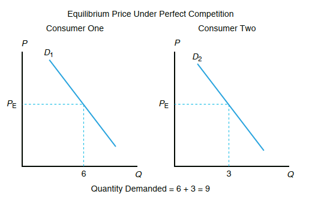
```

<br />

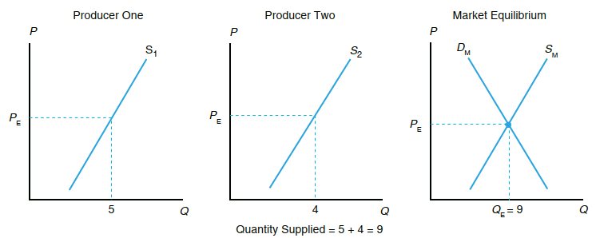

### Perubahan Keseimbangan

Shifts in either the demand curve or the supply curve will result in a new equi-
librium market price. Four possible events can occur that will affect the market equi-
librium price and quantity:

1. Demand increases, shifting the demand curve to the right.
2. Demand decreases, shifting the demand curve to the left.
3. Supply increases, shifting the supply curve to the right.
4. Supply decreases, shifting the supply curve to the left.


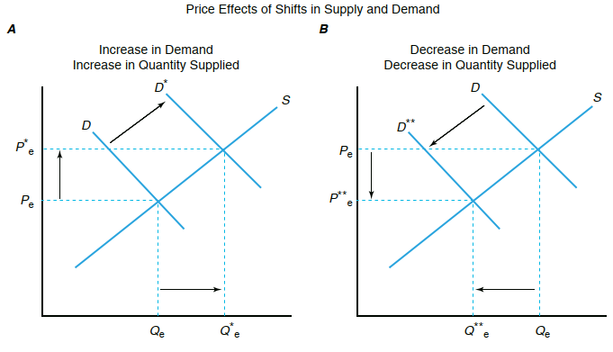
<br />

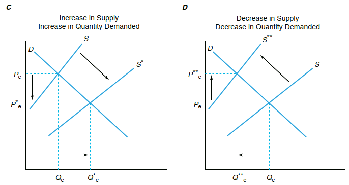


### Surplus Ekonomi Total


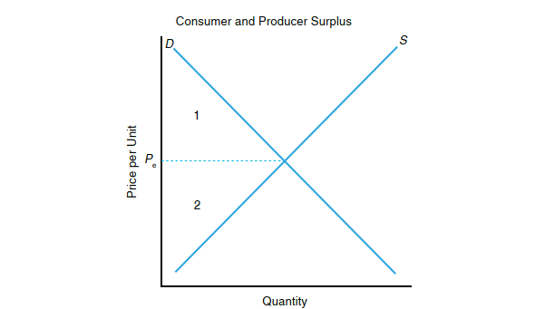
<br />

Dampak Kekeringan 

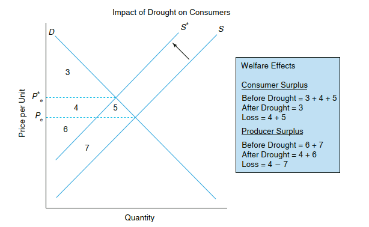
<br />

#### Penyesuaian Keseimbangan Pasar

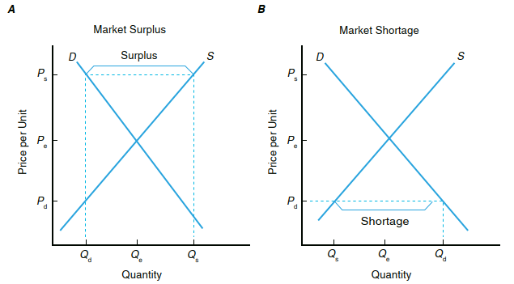
<br />

#### Penyesuaian Cobweb

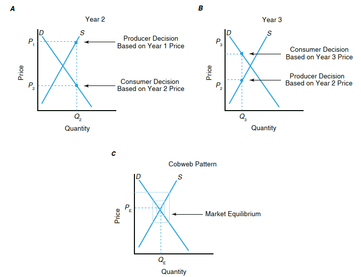
<br />

## Modul 9: Keseimbangan Pasar pada Persaingan Tidak Sempurna

### Karakteristik Struktur Pasar

There are four key interrelated structural characteristics used when discussing competitive behaviour of a market: 

1. the number and size distribution of sellers and buyers,
2. the degree of product differentiation,
3. the extent of barriers to entry, and
4. the economic environment within which the industry operates (i.e., the conditions of supply and demand).

These four characteristics, combined, determine whether an industry or various segments of the industry exhibit behaviour conducive to perfect competition or imperfect competition.

### PERSAINGAN TIDAK SEMPURNA DALAM PENJUALAN

- Market structure from the seller’s perspective can be classified into four types, 
based on the extent to which market prices are set by the forces of supply and demand. 
- These four types of competition in selling are

  1. perfect competition,
  2. monopolistic competition (imperfect competition),
  3. oligopoly (imperfect competition), and
  4. monopoly (imperfect competition).

#### Persaingan Monopolistik

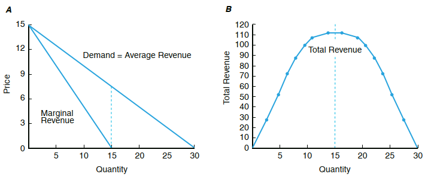

<br />

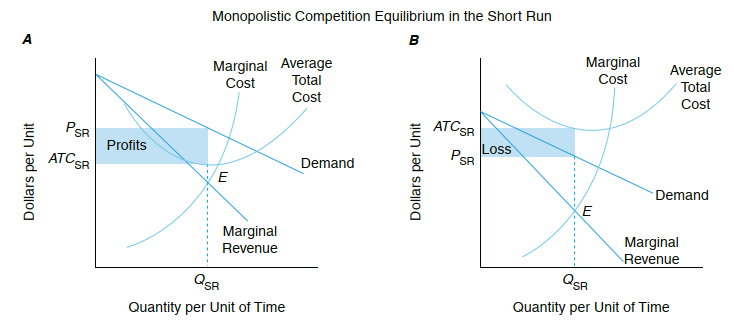
<br />

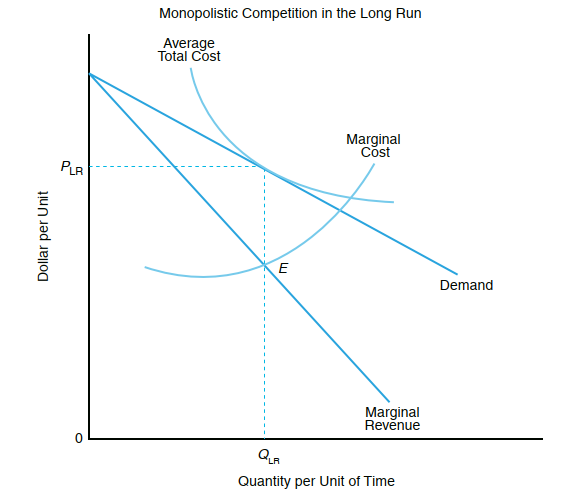
<br />

#### Oligopoli

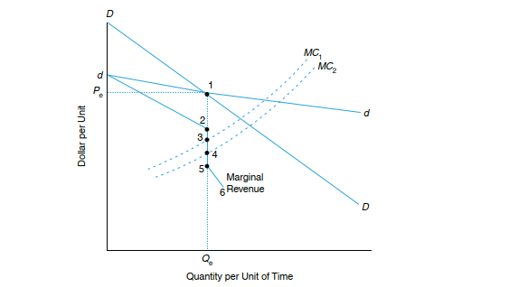

<br />

#### Monopoli

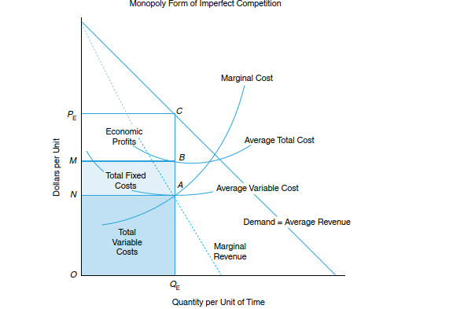

<br />

### Persaingan Tidak Sempurna dalam Pembelian

- Imperfect competition in buying activities can influence the market price for resources used in production. 
- Here the supply curve faced by the firm is upward sloping rather than perfectly flat or elastic, as was the case in perfect competition. 

#### Monopsoni

- A buyer in a perfectly competitive input market views the input supply curve as a 
horizontal line. 
- The perfectly competitive firm’s purchases are relatively small and 
perfectly elastic or do not perceptibly affect market price. 
- A monopsonist, however, is 
the only buyer in the market and faces an upward-sloping market input supply curve. 
- As a consequence, its buying decisions affect input prices. To increase its input usage, 
it is necessary for the monopsonist to pay a higher input price. 
- The monopsonist must 
therefore consider the marginal input cost (MIC) of purchasing an additional unit of 
a resource. 
- Marginal input cost is defined as the change in the cost of a resource used in 
production as more of this resource is employed.

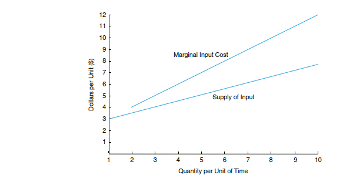
<br />

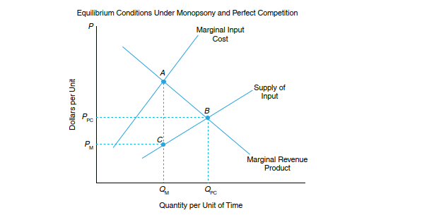

<br />


