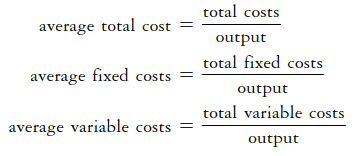
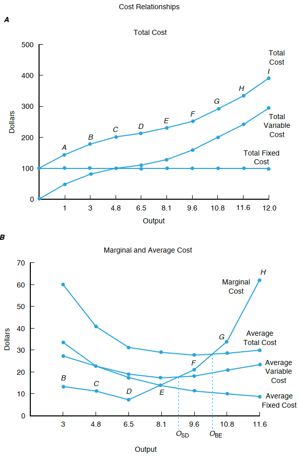
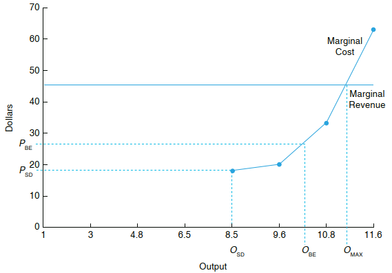
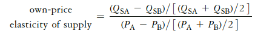

```{r load_packages, echo=FALSE}
library('fontawesome')
```

### `r fa("readme")` PENDAHULUAN
Modul ini membahas struktur biaya, penerimaan dan keuntungan usaha tani. Setelah mempelajari Modul ini Anda diharapkan mampu menjelaskan rasionalitas pengambilan keputusan petani dalam jangka pendek dan jangka panjang untuk menambah skala usaha dan meningkatkan daya saing. Secara khusus, Anda diharapkan mampu:

- `r emo::ji('check')` menjelaskan jenis-jenis biaya dan struktur biaya produksi.
- `r emo::ji('check')` menjelaskan keterkaitan biaya dan kinerja produksi.
- `r emo::ji('check')` menjelaskan maksimisasi keuntungan dari konsep biaya
- `r emo::ji('check')` menjelaskan penurunan fungsi penawaran dari biaya marjinal.

<br />


## `r emo::ji('books')` KEGIATAN BELAJAR: Pengambilan Keputusan Ekonomi

### A. BEBERAPA JENIS BIAYA PRODUKSI

- Farmers employ a wide variety of resources during the process of producing a particular good or service--> output adalah fungsi dari input (pertemuan sebelumnya).
- Untuk ini petani mengeluarkan biaya: petani padi, petani sawit, peternak ayam dll
- The total cost of production is the costs associated with the use of all inputs to production: variable and fixed costs  --> apa perbedaan antara keduanya?
  + Variable costs vary with the level of production. Fixed costs do not.
  + Biaya adalah fungsi dari output.
- Average cost (AC) involves measuring costs per unit of output, or the level 
of cost associated with the level of output.



- Another cost concepts related to the level of production that are extremely
important to economic decision making are marginal costs.
- Marginal cost (MC) is perhaps the most important cost concept. 
  + It is the change  in the business’s total cost per unit of change in output.
  



`Sumber: Pension (2018)`

<br />

### B. MAKSIMISASI KEUNTUNGAN DARI PERSPEKTIF BIAYA

--> Profit maximization: to determine where in stage II we should produce to 
maximize profits, we need to study average and marginal costs associated with production.

#### Marginal and Average Revenue

- The marginal revenue under conditions of perfect competition is the price the 
producer receives from the market.

$$marginal\ revenue = \Delta total\ revenue : \Delta output$$

- Average revenue reflects the revenue per unit of output the business receives for its product.

$$average\ revenue = total\ revenue : output$$

### Tingkat output yang memaksimumkan keuntungan (MC = MR criterion)

$$marginal\ revenue = marginal\ cost$$

--> Profit from production is maximized when the firm operates where marginal cost is equal to marginal revenue.

--> The level of profit is equal to the level of output multiplied by average profit, or the
difference between price and average total cost.


`Sumber: Pension (2018)`

### C. PENURUNAN KURVA PENAWARAN

- Firm supply curve: the marginal cost curve and the average variable cost curve help determine the minimum price at which a business can justify operating from an economic perspective. 
- In the short run is the portion of its marginal cost curve that lies above its 
average variable cost curve.


`Sumber: Pension (2018)`


- Market supply curve: the market supply curve for a particular product is based on the decisions of what and how much to produce made by individual businesses in an industry.
- It can be seen as a summation of all the firm supply curves, or the quantity each firm 
would be willing to supply for specific prices.


`Sumber: Pension (2018)`

### D. UKURAN ELASTISITAS PENAWARAN

- The market supply curve for a particular product generally has a positive slope because 
the quantity supplied by businesses increases when the price it receives goes up. 
- It is helpful to think of the behavioural response of producers in the context of their own-price elasticity of supply.



- The more (less) elastic or flatter (steeper) the market’s supply curve is, 
the greater (lower) the impact a price change will have on total revenue, all other 
things constant.

### Bagaimana dengan elastisitas silang penawaran?

<br />
<br />

<!-- AddToAny BEGIN -->
<div class="a2a_kit a2a_kit_size_16 a2a_default_style"; data-a2a-url="https://bangtedy.github.io/etan" data-a2a-title="Pengambilan Keputusan Ekonomi">
<a class="a2a_button_whatsapp"></a>
<a class="a2a_button_telegram"></a>
<a class="a2a_button_facebook"></a>
<a class="a2a_button_twitter"></a>
</div>
<script async src="https://static.addtoany.com/menu/page.js"></script>
<!-- AddToAny END -->
